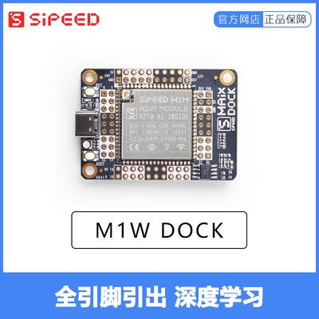
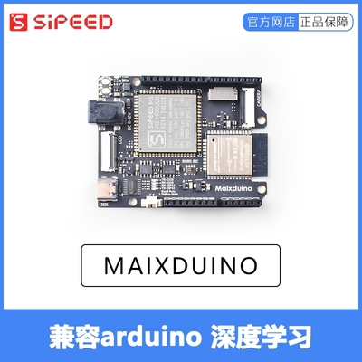

# MaixPy 文档简介

<div class="title_pic">
    
    <br/>
    
    <!-- <br/> -->
    
    <br/>
</div>

> **MaixPy** 官方文档官网: [**maixpy.sipeed.com**](https://maixpy.sipeed.com)
>
> **MaixPy** 官方文档中文镜像站: [**cn.maixpy.sipeed.com**](https://cn.maixpy.sipeed.com)
>
> **MaixPy** 例程仓库: [**Github: maixpy_script**](https://github.com/sipeed/MaixPy_scripts)
>
> 开发板资料下载: [**dl.sipeed.com**](http://dl.sipeed.com)
>
> Sipeed WIKI [**wiki.sipeed.com**](https://wiki.sipeed.com)

# 关于 MaixPy


[**MaixPy**](maixpy.sipeed.com) 是将 [Micropython](http://micropython.org/) 移植到 [K210](https://kendryte.com/)（一款 64 位双核带硬件 FPU、卷积加速器、FFT、Sha256 的 RISC-V CPU ） 的一个项目， 支持 MCU 常规操作， 更集成了机器视觉和麦克风阵列， 以快速开发具有极低成本和体积实用的 `AIOT` 领域智能应用。

> MicroPython 是基于 Python3 的语法做的一款解析器，包含了 Python3 的大多数基础语法， 主要运行在性能和内存有限的嵌入式芯片上。（注意 Micropython 不包含 Python3 的所有语法）

> K210 在硬件上集成了机器视觉和机器听觉能力， 是一款定位 AI 和 AIOT 市场的 SoC，同时也是一颗性能强劲的同时却有着极低的价格的 MCU 。


**MaixPy** 让我们在 K210 上编程更加简单快捷， 我们也将源代码开源在 [**Github/MaixPy**](https://github.com/sipeed/MaixPy) 上

比如我们需要扫描 **I2C** 总线上的设备，只需要使用如下代码即可实现：

```python
from machine import I2C

i2c = I2C(I2C.I2C0, freq=100000, scl=28, sda=29)
devices = i2c.scan()
print(devices)
```

同样，我们需要实现一个**呼吸灯**，只需要如下代码：

```python
from machine import Timer,PWM
import time

tim = Timer(Timer.TIMER0, Timer.CHANNEL0, mode=Timer.MODE_PWM)
ch = PWM(tim, freq=500000, duty=50, pin=board_info.LED_G)
duty=0
dir = True
while True:
    if dir:
        duty += 10
    else:
        duty -= 10
    if duty>100:
        duty = 100
        dir = False
    elif duty<0:
        duty = 0
        dir = True
    time.sleep(0.05)
    ch.duty(duty)
```

**实时拍照**：

```python
import sensor
import image
import lcd

lcd.init()
sensor.reset()
sensor.set_pixformat(sensor.RGB565)
sensor.set_framesize(sensor.QVGA)
sensor.run(1)
while True:
    img=sensor.snapshot()
    lcd.display(img)
```

## 这篇文档的内容

所有关于 MaixPy 的内容， 包括：
* 如何选择并得到一款合适自己的模块或者开发板
* 如何开始上手使用
* 库和接口（API）文档查询

## 可以运行MaixPy的开发板

首先我们选择一款适合自己的开发板， 目前有如下几款高性价比的开发板（核心板）：

<table border="2">
    <tr>
        <th colspan=3>MaixPy 系列开发板</th>
    </tr>
    <tr>
        <td>描述</td>
        <td>实物图</td>
        <td>说明</td>
    </tr>
        <td>Maix Amigo</td>
        <td>
            
            </p><a href="https://sipeed.taobao.com/">点击购买 Maix Amigo</a>
        </td>
        <td></td>
    <tr>
        <td>Maix Cube</td>
        <td>
            
            </p><a href="https://sipeed.taobao.com/">点击购买 Maix Cube</a>
        </td>
        <td></td>
    </tr>
    <tr>
        <td>Maix Dock(M1W)</td>
        <td>
            
            </p><a href="https://sipeed.taobao.com/">点击购买 Maix Dock(M1W)</a>
            </td>
        <td>全引脚引出</td>
    </tr>
    <tr>
        <td>Maix Dock(M1)</td>
        <td>
            
            </p><a href="https://sipeed.taobao.com/">点击购买 Maix Dock(M1)</a>
        </td>
        <td>全引脚引出</td>
    </tr>
    <tr>
        <td>Maix Bit</td>
        <td>
            
            </p><a href="https://sipeed.taobao.com/">点击购买 Maix Bit</a>
        </td>
        <td>全引脚引出</td>
    </tr>
    <tr>
        <td>Maix Duino</td>
        <td>
            
            </p><a href="https://sipeed.taobao.com/">点击购买 Maix Duino</a>
        </td>
        <td>兼容 Arduino</td>
    </tr>
    <tr>
        <td>Maix GO</td>
        <td>
            
            </p><a href="https://sipeed.taobao.com/">点击购买 Maix GO</a>
        </td>
        <td></td>
    </tr>
    <tr>
        <td>Maix Nano</td>
        <td>
            </br>
            
            </p><a href="https://sipeed.taobao.com/">点击购买 Maix Nano</a>
        </td>
        <td>核心开发板</td>
    </tr>
</table>

要获得这些板子，可以访问Sipeed（矽速）官网[www.sipeed.com](https://sipeed.com/)，或者[官方淘宝店](https://sipeed.taobao.com/)

更多硬件的资料请看 [Wiki 开发板介绍](https://wiki.sipeed.com/zh/maix/board/)


然后请**仔细查看左边目录**，然后开始使用吧～～


## MaixPy 源码

`MaixPy` 源码是指 运行在 `K210` 上的 `Micropython` 的解析器， 使用 `C语言` 编写，如果只是想使用 MaixPy，不需要了解源码；
如果想参与开发 MaixPy 的内置功能，可以下载进行开发，欢迎大家提交 `PR`

MaixPy 源码托管在 [github](https://github.com/sipeed/MaixPy)

|   分支     |   自动构建状态  |
| --------- | --------------- |
| master |  [](https://travis-ci.org/sipeed/MaixPy)   |


本项目主要由 &copy;</p><a href="https://www.sipeed.com" style="color: #f14c42">Sipeed</a> Co.,Ltd. 维护， 并接受来自开源社区的贡献， 具体贡献这见[贡献者列表](https://github.com/sipeed/MaixPy/graphs/contributors)

## MaixPy 文档源码

修改代码后，文档也会随之更新，

文档源码托管在 [github](https://github.com/sipeed/MaixPy_DOC)，如果文档有错别字或者改进可以提交PR，

注意： 在编辑文档前**必须**看[文档编写规范](contribute/doc_convention.md)

|   分支     |   文档自动构建状态  |
| --------- | --------------- |
| master |[](https://travis-ci.org/sipeed/MaixPy_DOC) |
| dev    |[](https://travis-ci.org/sipeed/MaixPy_DOC)    |


## 反馈

关于本文档或者功能或者源码方面的问题，也欢迎提交issue:

* [反馈](https://github.com/sipeed/MaixPy/issues)

------------
