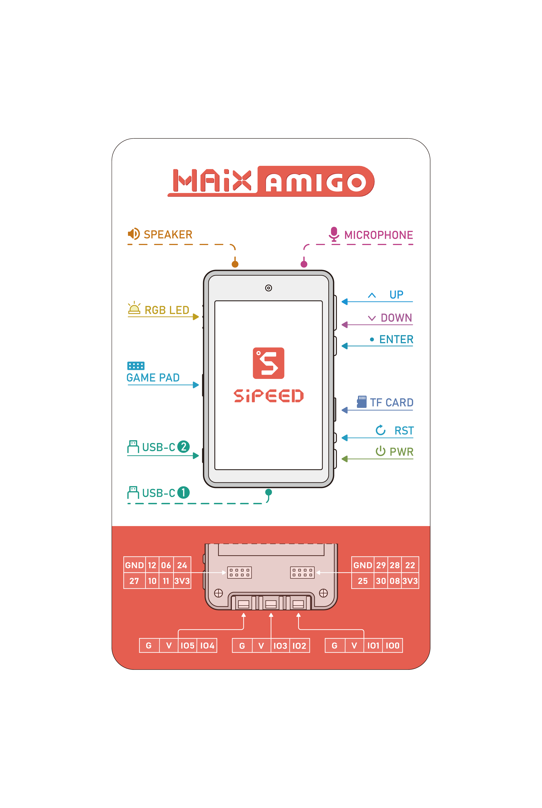

# MaixAmigo

## 概述

  SIPEED **MaixAmigo** 可开发编程学习套件, MaixAmigo 在硬件上集成前后各 30W 像素摄像头、可扩展 TF 卡槽、用户按键、3.5‘TFT 寸显示屏、520mAh 锂电池、扬声器,麦克风、SPMOD,GROVE 扩展接口等。

  软件上 MaixAmigo 默认搭载 MaixPy, 用户可以非常轻松的使用 MicroPython 语法快速进行人脸识别、物体分类等多种 AIoT 开发，同时还预留开发调试接口，也能将其作为一款功能强大的 AI 学习开发板。

## MaixAmigo 外观及功能介绍

### 外观一览




<!--  -->

### 板载硬件功能介绍

| 项目 | 说明 |
| ---- | ---- |
|CPU: |双核 64bit RISC-V / 400MHz* (双精度FPU集成)|
|内存: |8MiB 64bit 片上 SRAM|
|存储: |16MiB Flash, 支持 micro SDXC 拓展存储 (最大128GB**)|
|屏幕: |3.5寸 TFT 显示屏, 分辨率: 320\*480, 支持电容触摸(FT6X36) |
|摄像头: |OV7740 (后摄)与GC0328(前摄) |
|电池: |板载可充电锂聚合物电池 (容量520mAh ) |
|板载扬声器与麦克风| 集成单音频控制器 ES8374 1W 8Ω 扬声器|
|板载接口: |USB-C \*2 (K210 调试供电接口+兼容 STM32 核心板 USB 接口)  Grove \*3 & SPMOD\*3 (可拓展模块)|
|三轴加速度传感器:| MSA301|
|电池:| 520mAh 锂电池 |

### 硬件板载扩展接口

MaixAmigo 对用户开放了两个高度扩展的接口: SP-MOD 与 Grove 接口,
用户可以很方便的进行 DIY

#### SP-MOD 接口

SP-MOD 即为 sipeed module, simplify PMOD, super module

| 接口 | 接口描述 |
|---|---|
|SP-MODE 接口描述||
|硬件接口||

MaixAmigo 板载了三个 SPMOD 接口

| PIN\NO.1 | SP-MOD 1 | SP-MOD2 | SP-MOD3(游戏手柄) |
| --- | --- | --- | --- |
| 1 | GND | GND | GND |
| 2 | 12  | 29  | --- |
| 3 | 6   | 28  | --- |
| 4 | 24  | 22  | IO24 |
| 5 | 27  | 25  | IO27 |
| 6 | 10  | 30  | --- |
| 7 | 11  | 8   | --- |
| 8 | 3V3 | 3V3 | 3V3 |

#### Grove 接口

- Grove 模块接口

Grove 接口的线缆有 4 种颜色，用户可以根据颜色快速区别


| Pin | 颜色 | 描述 |
| --- | --- | --- |
| 1 | 黄色 | (例如, I2C Grove Connectors 上的SCL) |
| 2 | 白色 | (例如, I2C Grove Connectors 上的SDA) |
| 3 | 红色 |   VCC (所有的Grove接口红色都是VCC) |
| 4 | 黑色 |   GND (所有的Grove接口黑色都是GND) |

MaixAmigo 板载了三个 GROVE 接口

| PIN | GROVE 1 | GROVE 2 | GROVE 3 |
| --- | --- | --- | --- |
| 1 | GND | GND | GND |
| 2 | 3V3 | 3V3 | 3V3 |
| 3 | IO5 | IO3 | IO1 |
| 4 | IO4 | IO2 | IO0 |

### 板载 I2C 设备

MaixAmigo 板载 I2C 传感器/IC

| IC | 设备 id | I2C 地址(7位地址) |配置：SCL: IO_24, SDA: IO_27|
| --- | --- | --- | --- |
|---|I2C Address| <<1|MaixPy 读取地址|
|ES8374|0x08|0x10|D(16)|
|MSA301|0x13|0x26|D(38)|
|AXP173|0x68|0x34|D(52)|


## 上手把玩

由于 MaixAmigo 出厂自带 GUI 演示界面和示例程序，所以在拿到板子时可以先上手把玩下预设程序，
在之后那么我们就开始以 MaixAmigo 上手，借助 MaixPy 入门 AIoT.

而在开发之前我们需要了解并准备相关工具，以减少我们后边因为准备不足而走的坑路

上手步骤:

1. 下载需要的驱动，软件
2. 开发板连接电脑，并安装 USB 驱动
3. 更新最新固件
4. 下载并打开最新的 MaixPy IDE
5. MaixPy IDE 连接开发板 运行 MaixPy 示例程序

#### 软硬件准备

硬件准备:

  - **电脑**一台
  - **MaixAmigo** 开发板
  - **可靠**的 USB Type-C 数据线一条: 注意一定要**可靠**的数据线

软件准备:

  - USB 驱动: **FT2232** ->[[下载链接点这里](https://dl.sipeed.com/MAIX/tools/ftdi_vcp_driver)](https://dl.sipeed.com/MAIX/tools/ftdi_vcp_driver)
  - Kflash_gui: [https://dl.sipeed.com/MAIX/tools/kflash_gui](https://dl.sipeed.com/MAIX/tools/kflash_gui)
  - MaixPy IDE : [https://dl.sipeed.com/MAIX/MaixPy/ide/_/v0.2.5](https://dl.sipeed.com/MAIX/MaixPy/ide/_/v0.2.5)
  - 例程程序库: [https://github.com/sipeed/MaixPy_scripts](https://github.com/sipeed/MaixPy_scripts)

####  安装驱动

我们在拿到 MaixAmigo 并连接到电脑的时候，可以打开设备管理器查看串口驱动是否已经安装，打开设备管理器的方法有:
- 此电脑(右键) -> 属性 -> 设备管理器
- 开始菜单(右键) -> 设备管理器
- 控制面板 -> (搜索)设备管理器

  

1. 当我们的系统是 Win10 系统，系统则会帮我们自动安装驱动，而如果是旧版 Win7，win8 系统我们就需要自己手动安装:
    

1. 打开上一节的的链接下载驱动
    
1. 点击安装
    
1. 安装完成之后，可以在设备管理器看到已经识别到两个串口设备了
    


### 更新固件到最新版

  用户拿到开发板之后，板载的固件默认或许已经不是最新版的，那么在使用过程中会存在或多或少的 bug，
  我们这时候就需要更新固件版本到最新版本

  更新方法查看: [更新固件](../get_started/upgrade_maixpy_firmware.md)


###  运行第一个程序 `Hello World`


- LCD 实时预览 Camera


```python
# -*- coding: UTF-8 -*-
# Amigo_sensor - By: Echo - 周五 4月 2 2020
# start of pmu_axp173.py
import sensor, image, time, utime, lcd
from machine import I2C, Timer
from fpioa_manager import fm
from Maix import GPIO

'''
说明: 该例程为 Amigo 前后摄像头切换的 example.
注意事项: 由于 Amigo 电源管理电路的设计 需要配置 PMU AXP173 的输出电压, 才可以正常使用摄像头
'''

# -------------
class AXP173:
    class PMUError(Exception):
        pass
    class OutOfRange(PMUError):
        pass
    def __init__(self, i2c_dev=None, i2c_addr=0x34):
        from machine import I2C
        if i2c_dev is None:
            try:
                self.i2cDev = I2C(I2C.I2C0, freq=400000, scl=24, sda=27)
            except Exception:
                raise PMUError("Unable to init I2C0 as Master")
        else:
            self.i2cDev = i2c_dev
        self.i2cDev.scan()
        self.axp173Addr = i2c_addr
    def __write_reg(self, reg_address, value):
        self.i2cDev.writeto_mem(
            self.axp173Addr, reg_address, value, mem_size=8)
    def writeREG(self, regaddr, value):
        self.__write_reg(regaddr, value)

# end of pmu_axp173.py
# ------------------------

# i2cDev = I2C(I2C.I2C0, freq=400000, scl=24, sda=27)
# print(i2cDev.scan())
axp173 = AXP173()
axp173.writeREG(0x27, 0x20)
axp173.writeREG(0x28, 0x0C)

lcd.init(freq=20000000)

while True:
    try:
        sensor.reset(choice=1)
        sensor.set_pixformat(sensor.YUV422)
        sensor.set_framesize(sensor.QVGA)
        sensor.skip_frames(time=2000)
        for i in range(50):
            img = sensor.snapshot()
            lcd.display(img)
    except Exception as e:
        print(e)

    try:
        sensor.reset(choice=2)
        sensor.set_pixformat(sensor.YUV422)
        sensor.set_framesize(sensor.QVGA)
        sensor.skip_frames(time=2000)
        for i in range(50):
            img = sensor.snapshot()
            lcd.display(img)

    except Exception as e:
        print(e)

```
