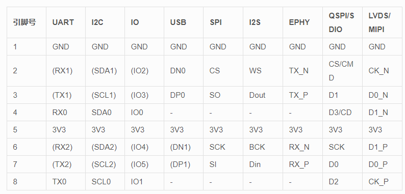
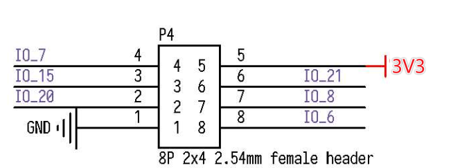
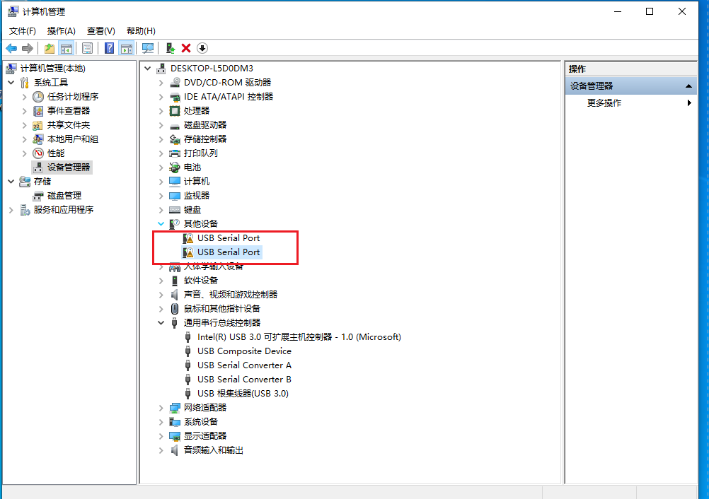

# MaixCube 外观及功能介绍

## 概述

  SIPEED **MaixCube** 可开发编程学习套件, MaixCube 在硬件上集成 30W 摄像头、可扩展 TF 卡槽、用户按键、IPS 1.3 寸显示屏、200mAh 锂电池、扬声器,麦克风、SPMOD,GROVE 扩展接口等。
  软件上 MaixCube 默认搭载 MaixPy, 用户可以非常轻松的使用 MicroPython 语法快速上手 AI IoT 开发，开发人脸识别，物体识别等 AI 应用，同时还预留开发调试接口，也能将其作为一款功能强大的 AI 学习开发板。

## MaixCube 外观及功能介绍

### 外观一览


- 1.3 寸 **IPS** 屏幕: 分辨率 **240*240**
- 复位按键
- 电源按键: 短按开机，长按 *8S* 关机
- Grove 接口: **Grove** 数字接口，传感器，控制器扩展无限可能~
- SP-MOD 接口: 搭载更加强大，更高扩展性的 **SP-MOD** 数字接口，I2C，SPI(标准，双线，四线模式)等接口均可以使用
- TF 卡槽: 多媒体资源扩展，支持大容量储存
- 摄像头: 搭载 **0V7740** **30W** 像素 **Sensor**
- Type-C 接口:
- 三向按键:


### 板载功能介绍


- 电源管理控制单元: AXP173
  - 板载 200mAh 锂电池，支持用户充放电控制
- 音频驱动 IC: ES8374
  - 支持音频录制，播放
- 三轴加速度传感器: MSA301
- Camera OV7740:
- 1.3 IPS LCD:
- RGB: 板载两颗 RGB LED
- USB Type-C:Type-C 接口，正反盲插


### 板载扩展接口

Maix Cube 对用户开放了两个高度扩展的接口: SP-MOD 与 Grove 接口，
用户可以很方便的进行 DIY

#### SP-MOD 接口

SP-MOD 即为 sipeed module，simplify PMOD，super module

| 接口             | 接口描述                                                     |
| ---------------- | ------------------------------------------------------------ |
| SP-MODE 接口描述 |  |
| 硬件接口         |  |

#### Grove 接口

- Grove 模块接口

Grove 接口的线缆有 4 种颜色，用户可以根据颜色快速区别


| ---   | 颜色 | 描述                                |
| ----- | ---- | ----------------------------------- |
| pin 1 | 黄色 | (例如，I2C Grove Connectors上的SCL) |
| pin 2 | 白色 | (例如，I2C Grove Connectors上的SDA) |
| pin 3 | 红色 | VCC (所有的Grove接口红色都是VCC)    |
| pin 4 | 黑色 | GND (所有的Grove接口黑色都是GND)    |

Grove模块主要有 4 种接口:

1. Grove Digital 数字接口:<br/>
    Grove 数字接口由 Grove 插头的四条标准线组成.<br/>
    两条信号线通常称为 D0 和 D1 .<br/>
    大多数模块只使用D0，但有些(像LED Bar Grove显示屏)使用两者.通常核心板会将板卡上的第一个Grove连接头称为D0，第二个称为D1.第一个接头会连接到主控芯片的DO/D1管脚，第二个连接头会连接到主控芯片的D1/D2引脚，后面的连接头以此类推.

| pin  | Function             | Note |
| ---- | -------------------- | ---- |
| pin1 | Dn 第一个数字输入    | —    |
| pin2 | Dn+1 第二个数字输入  | —    |
| pin3 | VCC 供电引脚 5V/3.3V | —    |
| pin4 | GND 地               | —    |


2. Grove UART :<br/>
    The Grove UART 是特殊的一种数字输入输出接口.<br/>
    它使用引脚 1 和引脚 2 进行串行输入和发送. <br/>
    引脚1是 RX 线(用于接收数据，因此是输入)，
    其中引脚 2 是 TX 线(用于向 Grove 模块传输数据).

| pin  | Function | Note             |
| ---- | -------- | ---------------- |
| pin1 | RX       | 串行接收         |
| pin2 | TX       | 串行发送         |
| pin3 | VCC      | 供电引脚 5V/3.3V |
| pin4 | GND      | 地               |

3. Grove I2C:<br/>
    有许多类型的I2C Grove 传感器可用.<br/>MaixCube 上的 Grove 只支持 3.3V 传感器

  Grove I2C 连接器具有标准布局.引脚 1 是SCL信号，引脚 2 是SDA信号

| pin  | Function | Note              |
| ---- | -------- | ----------------- |
| pin1 | SCL      | I2C 时钟          |
| pin2 | SDA      | I2C 数据          |
| pin3 | VCC      | 供电引脚，5V/3.3V |
| pin4 | GND      | 地                |

### 板载 I2C 设备

MaixCube  板载 I2C 传感器/IC

| IC     | 设备 id     | I2C 地址(7位地址) | 配置：SCL: IO_30，SDA: IO_31 |
| ------ | ----------- | ----------------- | ---------------------------- |
| ---    | I2C Address | <<1               | MaixPy 读取地址              |
| ES8374 | 0x08        | 0x10              | D(16)                        |
| MSA301 | 0x13        | 0x26              | D(38)                        |
| AXP173 | 0x68        | 0x34              | D(52)                        |


## 上手把玩

由于 MaixCube 出厂自带 GUI 演示界面和示例程序，所以在拿到板子时可以先上手把玩下预设程序，
在之后那么我们就开始以 MaixCube 上手，借助 MaixPy 入门 AIoT.

而在开发之前我们需要了解并准备相关工具，以减少我们后边因为准备不足而走的坑路

上手步骤:

1. 下载需要的驱动，软件
2. 开发板连接电脑，并安装 USB 驱动
3. 更新最新固件
4. 下载并打开最新的 MaixPy IDE
5. MaixPy IDE 连接开发板 运行 MaixPy 示例程序

#### 软硬件准备

硬件准备:

  - **电脑**一台
  - **MaixCube** 开发板
  - **可靠**的 USB Type-C 数据线一条: 注意一定要**可靠**的数据线

软件准备:

  - USB 驱动: **FT2232** ->[[下载链接点这里](https://dl.sipeed.com/MAIX/tools/ftdi_vcp_driver)](https://dl.sipeed.com/MAIX/tools/ftdi_vcp_driver)
  - Kflash_gui: [https://dl.sipeed.com/MAIX/tools/kflash_gui](https://dl.sipeed.com/MAIX/tools/kflash_gui)
  - MaixPy IDE : [https://dl.sipeed.com/MAIX/MaixPy/ide/_/v0.2.5](https://dl.sipeed.com/MAIX/MaixPy/ide/_/v0.2.5)
  - 例程程序库: [https://github.com/sipeed/MaixPy_scripts](https://github.com/sipeed/MaixPy_scripts)

####  安装驱动

我们在拿到 Maix Cube 并连接到电脑的时候，可以打开设备管理器查看串口驱动是否已经安装，打开设备管理器的方法有:
- 此电脑(右键) -> 属性 -> 设备管理器
- 开始菜单(右键) -> 设备管理器
- 控制面板 -> (搜索)设备管理器

  

1. 当我们的系统是 Win10 系统，系统则会帮我们自动安装驱动，而如果是旧版 Win7，win8 系统我们就需要自己手动安装:
    

1. 打开上一节的的链接下载驱动
    
1. 点击安装
    
1. 安装完成之后，可以在设备管理器看到已经识别到两个串口设备了
    


### 更新固件到最新版

  用户拿到开发板之后，板载的固件默认或许已经不是最新版的，那么在使用过程中会存在或多或少的 bug，
  我们这时候就需要更新固件版本到最新版本

  更新方法查看: [更新固件](../get_started/upgrade_maixpy_firmware.md)


###  运行第一个程序 `Hello World`


- LCD 实时预览 Camera

```python
import sensor, image, time, lcd

sensor.reset()
sensor.set_pixformat(sensor.RGB565)
sensor.set_framesize(sensor.QVGA)
sensor.skip_frames(time = 2000)
sensor.set_hmirror(1)
sensor.set_vflip(1)

clock = time.clock()

lcd.init(type=2)
lcd.rotation(2)

while(True):
    clock.tick()
    img = sensor.snapshot()
    print(clock.fps())
    img.draw_string(60, lcd.height()-120, "fps:"+str(clock.fps()), lcd.GREEN, scale=2)
    lcd.display(img)

```

1. 资料下载

Sipeed-Maix-Cube 资料下载: [Sipeed-Maix-Cube](https://dl.sipeed.com/shareURL/MAIX/HDK/Sipeed-Maix-Cube)

Sipeed-Maix-Cube 规格书下载: [Sipeed-Maix-Cube](https://dl.sipeed.com/fileList/MAIX/HDK/Sipeed-Maix-Cube/ProductSpecification/Sipeed%20Maix%20Cube%20Datasheet%20V1.0.pdf)

Sipeed-Maix-Cube 原理图下载：[Sipeed-Maix-Cube](https://dl.sipeed.com/fileList/MAIX/HDK/Sipeed-Maix-Cube/Maix-Cube-2757/Maix-Cube-2757(Schematic).pdf)
