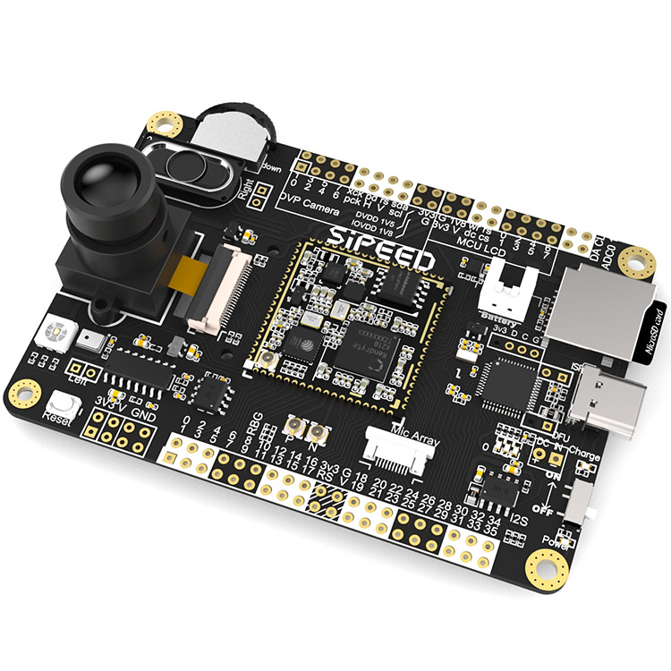

# Maix Go

### 板载功能介绍

| 项目 | 说明 |
| ---- | ---- |
|CPU: |双核 64bit RISC-V / 400MHz* (双精度FPU集成)|
|内存: |8MiB 64bit 片上 SRAM|
|存储: |16MiB Flash, 支持 micro SDXC 拓展存储 (最大128GB**)|
|屏幕: |2.4 寸 TFT, 电容触摸屏幕分辨率: 320\*240 |
|摄像头(套餐): | 200W 像素(实际使用 30W)，0V2640 型号 M12 摄像头 |

### 外观一览

1. 资料下载

Sipeed-Maix-Go 资料下载: [Sipeed-Maix-Go](https://dl.sipeed.com/shareURL/MAIX/HDK/Sipeed-Maix-GO)
