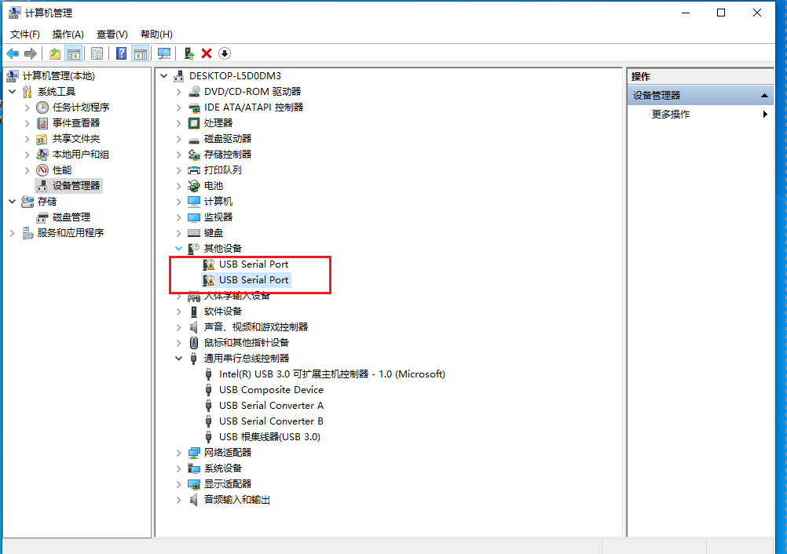
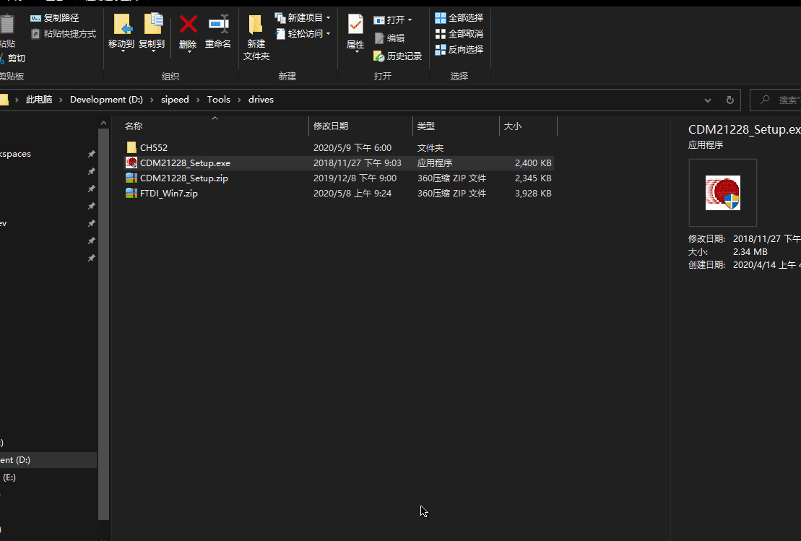

安装 USB 驱动
=====

正式使用 MaixPy 之前，我们需要先安装好串口驱动，才可进行下一步的开发与使用；因为板子是通过 USB 转串口设备与电脑连接（K210 没有 USB 硬件支持功能）。
根据板子的 USB 转串口芯片型号装驱动。

> 在 `Linux` 或者 `Mac` 下操作串口， 如果不想每次都使用 `sudo` 命令， 执行 `sudo usermod -a -G dialout $(whoami)` 将自己添加到 `dialout` 用户组即可，可能需要注销或者重启才能生效

- 现有开发板板载的 USB 转串口 IC 说明

| 开发板型号 | USB 转串口 IC        | 说明                  |
| ---------- | ----------------------- | --------------------- |
| Maix Go    | STM32                   | STM32 USB 模拟 FT2232 |
| Maix Dock  | CH340                   |                       |
| Maix Duino | CH552                   | CH552 模拟 FT2232     |
| Maix Bit   | CH552(新版)/CH340(旧版) | CH552 模拟 FT2232     |
| Maix Cube  | GD32(新版)/CH552(旧版)  | CH552 模拟 FT2232     |
| Maix Amigo | GD32                    | GD32 模拟 FT2232      |

> 使用 CH340 IC 的板子直接装 CH340 的驱动即可，其他的均使用 FT2232 的驱动程序

### 对于 `Dan Dock` 和 `Maix Bit`（旧版）

开发板使用了 `CH340` ：

Linux 不需要装驱动，系统自带了，使用 `ls /dev/ttyUSB*` 即可看到设备号
Windows 在网上搜索 `CH340 驱动` 下载安装即可，然后可以在 `设备管理器` 中看到串口设备

### 对于 `Maix Go`

开发板使用了一颗 `STM32` 来实现模拟串口以及 `JTAG` 功能， `Windows` 需要安装 `FT2232` 的驱动，请自行搜索 `FT2232 驱动` 下载安装

这款 `STM32` 芯片的固件出厂默认采用 [open-ec](https://github.com/sipeed/open-ec) 的固件， 如果没问题，则会出现一个或者两个串口， 比如 `Linux` 下出现两个串口 `/dev/ttyUSB0` 和 `/dev/ttyUSB1`， 下载和访问串口时请使用 `/dev/ttyUSB1`。 Windows 也类似。

如果需要重新烧录这个固件，可以从 [github](https://github.com/sipeed/open-ec/releases) 或者 [官网下载 open-ec 固件](http://dl.sipeed.com/MAIX/tools/flash-zero.bin)， 然后使用 `ST-LINK` 连接板子上引出的 `STM32` 的 `SW` 引脚（`GND`, `SWDIO`, `SWCLK`）进行烧录。（目前版本的 `Go` 板子上的 `STM32` 不支持串口烧录，只能使用 `ST-LINK` 进行烧录， 有需要请自行购买，或者使用一款板子用 `IO` 模拟也可以（比如树莓派） ）

除了 `open-ec` 还有 `CMSIS-DAP` 固件， 相比 `open-ec` 可以模拟 `JTAG` 来对板子进行调试， `open-ec` 目前还未支持模拟 `JTAG`， 可以 [从官网下载固件](http://dl.sipeed.com/MAIX/tools/cmsis-dap/)， 使用 `ST-LINK` 对其进行烧录， 在 `Linux` 下会出现 `/dev/ttyACM0` 设备

> ST-LINK 对 `STM32` 的烧录方法资料很全，请自行搜索

**请注意对 STM32 更新固件和更新 MaixPy 固件是不一样的， 一般情况不需要更新 STM32的固件， 默认的即够用了， STM32 只是一个 USB转串口的工具而已！！！勿混淆。。。**

### 对于 `Maixduino` 开发板 和 `Maix Bit` 新版带麦克风版本（使用`CH552`） 开发板

开发板使用了 `CH552` 芯片来实现 `USB` 转串口功能，没有 `JTAG` 模拟功能，
`Windows` 需要安装 `FT2232` 的驱动，请自行搜索 `FT2232 驱动` 下载安装

##  安装驱动

- USB 驱动: **FT2232** ->[[下载链接点这里](https://dl.sipeed.com/MAIX/tools/ftdi_vcp_driver)](https://dl.sipeed.com/MAIX/tools/ftdi_vcp_driver)

我们在拿到 MaixPy 开发板并连接到电脑的时候, 可以打开设备管理器查看串口驱动是否已经安装,打开设备管理器的方法有:
- 此电脑(右键) -> 属性 -> 设备管理器
- 开始菜单(右键) -> 设备管理器
- 控制面板 -> (搜索)设备管理器

1. 当我们的系统是 Windows 10 系统,系统则会帮我们自动安装驱动，而如果是旧版 Win7，win8 系统，我们就需要自己手动安装 USB 驱动:
    

2. 打开上一节的的链接下载驱动
    

3. 点击安装
    

4. 安装完成之后,可以在设备管理器看到已经识别到两个串口设备了(其中只有一个串口可用)
    

## 关于 USB 串口的疑难杂症排查

如果没有看到串口，请按如下顺序排查硬件问题。

- 插入电脑，是否存在叮咚一声，如插入 U 盘时USB 驱动加载的声音，没有表示硬件上的串口芯片出问题了。
- 更换线材重试，更换电脑 USB 口重试，仍然加载不出来，更换电脑确认。

如果没有办法烧录固件，请按如下顺序排查硬件问题。

- 使用串口工具查看硬件当中是否存在 maixpy 固件
- 设置 115200 波特率连接串口，按复位键（RST）接收到芯片的数据，不管是什么都表示串口芯片工作正常，如果没有则表示硬件异常。
- 基于上述再进行烧录固件，烧录前，按硬件的 BOOT 键后按复位，再松开 BOOT 键，此时烧录正常进行，如果没有则表示 Flash 受损，可以尝试烧录到 SRAM ，如果烧录失败，则表示串口芯片异常。
- 如果到这里了，还是不能解决问题，则硬件确实存在缺陷

### K210 的烧写机制介绍

我们常把这个称为一键下载电路，表示能够轻松的通过控制 串口的 RST 和 DTR 的完成对 BOOT 和 RST 引脚的控制进入烧录模式，如上描述的期望硬件电路自动完成最初由人按下 BOOT 后按 RST 的操作，这与硬件实现强相关，基于此，再进行 TX 和 RX 的数据传输，所以实际上我们需要用到 UART 串口的功能引脚。

在 Kflash 中分多种版型多种烧写方式的触发，我们可以简单分为几类，低速的 115200 和 高速的 1500000 波特率，以这两类波特率所匹配的烧录方式为差异点，如果发现下载过程中失败，可以适当的降低波特率，这是由于串口芯片工作不稳定导致，而工具中对版型选择只是会影响第一段烧录模式的触发，而在这之后的烧写固件中就会采取配置的波特率进行烧写，通常不超过与flash的通信烧录速度，常见于 50~60 KB/S。

如果发现无论如何更换烧录模式都无法进入，要么是烧录版型不匹配，要么是串口芯片的 DTR RST 引脚出了问题（物理上的）。

