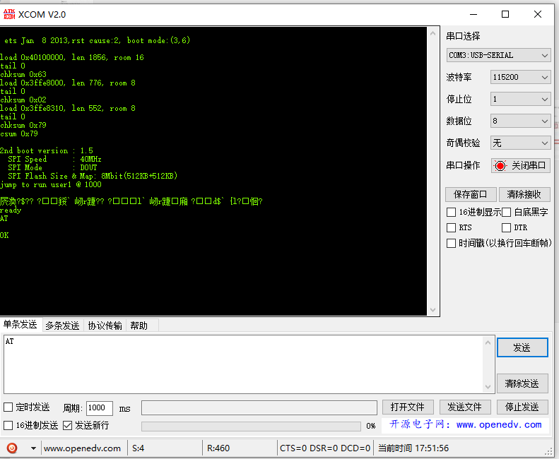

# 更新板载 ESP8285 固件

## 简介：

目前 MaixPy 系列采用 M1W 模块的作为核心模块的开发板有: MaixDock(M1W)， MaixGo

通常情况下我们不需要更新模块内部 WIFI SOC ESP8285 的固件，但是如果使用过程中存在 bug，以及有新版本的固件发布是我们就可以更新固件


## 验证 ESP8285 是否能够正常工作

- MaixDock 验证 ESP8285 是否正常工作例程

   ```python
   ------
   ```

- MaixGo 验证 ESP8285 是否正常工作例程

   ```python
   ------
   ```

- 外接 USB 转串口模块测试

   使用 USB 转串口模块，按照下表连接之后上电

   | M1W                                    | USB 模块 | 说明 |
   | -------------------------------------- | -------- | ---- |
   | M1W GND                                | GND      | 共地 |
   | K210 (IO6)/ESP8285 TX                 | RX       |      |
   | K210 (IO7)/ESP8285 RX                  | TX       |      |
   | k210 RST(上电之前接地，全过程拉低 RST) | GND      |      |
   |                                        |          |      |
   |                                        |          |      |
   |                                        |          |      |

   使用串口助手 (这里使用 XCOM) 来验证 ESP8285 是否正常启动
   


## AT 指令集

ESP8285 和 ESP8266 为同一系列产品，使用同一套 AT 指令集
ESP8285/ESP8266/ESP32 最新 AT指令集 https://github.com/espressif/esp-at/blob/v2.0.0.0_esp8266/docs/ESP_AT_Commands_Set.md


## 更新 ESP8285 固件步骤

### 准备

> 这里以 MaixDock(M1W), Windows 10 系统为例

- 硬件: MaixDock, USB Type-C 数据线
- 软件:

- ESP 固件更新工具：ESP8285 **flash_download_tools**
  - 下载链接：乐鑫官网：[**flash_download_tools**]()
- ESP8285 AT 固件：
  - 下载链接：[**flash_download_tools**](https://cn.dl.sipeed.com/MAIX/factory_firmware/)

### 更新流程：

1. 下载 **flash_download_tools**，

   
   

2. 下载 **MaixDock ESP8285 固件**
   

3. 连接 MaixDock, 选择 ESP8285 串口(一般都是串口号比较大的)
4. 设置下载选项:
   1. 如图配置相应选项, 注意**波特率一定要设置为 115200**
   
   

5. 点击 **Start** 更新固件，并等待完成更新
6. 验证更新是否完成
   1. 使用 XCOM, 打开 ESP8285 串口，点击 RST 复位 ESP，如图即刷入成功
   2.
