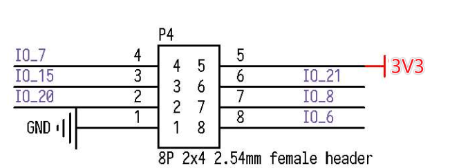

SP_MOD
======

采用 sp_mod 标准接口的模块。

## SP-MOD 接口

SP-MOD 即为 sipeed module, simplify PMOD, super module

| 接口 | 接口描述 |
|---|---|
|SP-MODE 接口描述||
|硬件接口(举例)||

MaixAmigo 板载了三个 SPMOD 接口

| PIN\NO. | SP-MOD1 | SP-MOD2 | SP-MOD3(游戏手柄) |
| --- | --- | --- | --- |
| 1 | GND | GND | GND |
| 2 | 12  | 29  | --- |
| 3 | 6   | 28  | --- |
| 4 | 24  | 22  | IO24 |
| 5 | 27  | 25  | IO27 |
| 6 | 10  | 30  | --- |
| 7 | 11  | 8   | --- |
| 8 | 3V3 | 3V3 | 3V3 |

## 外设模块

* [SP_BT 蓝牙透传](./sp_bt.md)
* [SP_LoRa 无线通信](./sp_lora.md)
* [SP_RFID 射频识别](./sp_rfid.md)
* [SP_TOF 测距](./sp_tof.md)
* [SP_Eink 电子墨水屏](./sp_eink.md)
* [SP_LCD1.14 IPS屏](./sp_lcd1.14.md)
* [SP_Weather 气象传感](./sp_weather.md)
* [SP_Ethernet 有线网口](./sp_ethernet.md)
